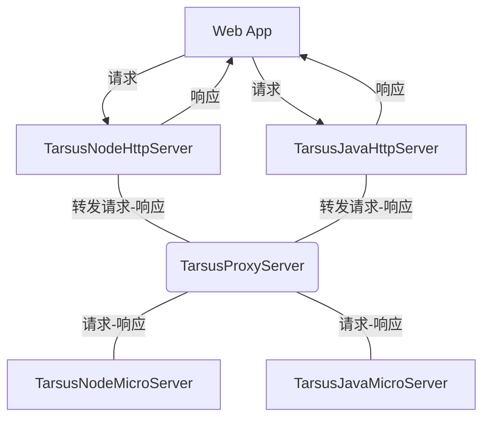

# Tarsus FrameWork

---

Tarsus FrameWork 由 [Ado](https://github.com/chelizichen/ado-node)项目升级而来， 在 **Ado系列项目** 的设计中学到了很多的知识，比如一些常用的设计模式、数据库API的封装、ORM的设计、命令行与脚手架的设计、Redis的使用、微服务相关的概念，也明白了过度的封装只会让代码变得棘手和难以处理，大量的注解和装饰器也会让代码难以调试和阅读，Tarsus将会汲取这些失败的经验和设计，构建出更快更简便的 **FrameWork**。

---

## 整合的仓库

- [@Tarsus/Node](https://github.com/chelizichen/Tarsus) 包含 Http服务  微服务模块 依赖注入 ORM 等多个开发包的库
- [@Tarsus/Java-Proxy](https://github.com/chelizichen/Tarsus-Java-Proxy) SpringBoot，可以提供Http 服务，也可以调用微服务
- [@Tarsus/Java](https://github.com/chelizichen/Tarsus-Java) Java 微服务模块 示例代码
- [@Tarsus/CLI](https://github.com/chelizichen/Tarsus-cli) 构建Tarsus的命令行工具

### 微服务架构模型

