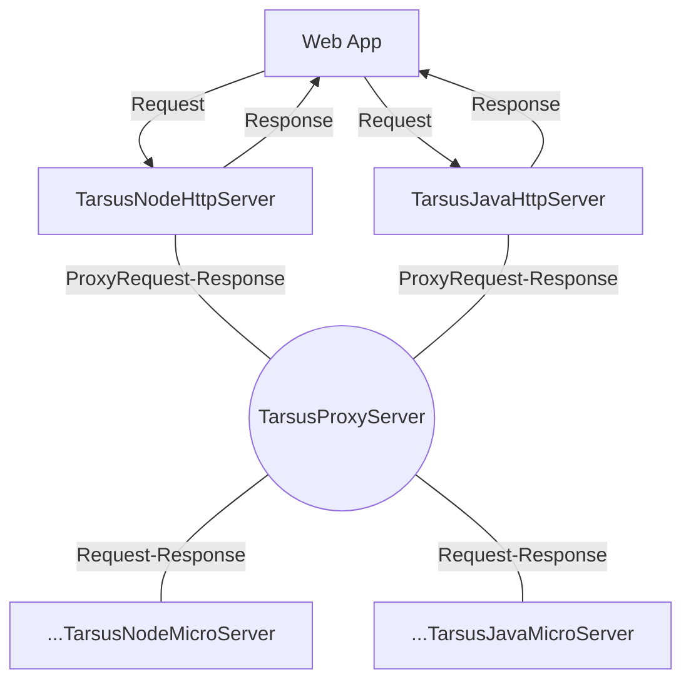

# Tarsus FrameWork

---

Tarsus FrameWork is an evolution of the ADO project to quickly create and launch HTTP services or microservices with the help of ECMAScript decorators and Java8 annotations. The decorator feature in ECMAScript has officially entered the ES2018 release, which allows developers to worry about compatibility issues. Decorator is a special grammatical abstraction that can decorate classes, methods, and objects, making it easier for developers to write and manage program logic, increasing the readability of the program, and making its logic coherent and understandable. In addition, using TypeScript and Java development can provide more vivid semantics, help Devs work more quickly, and effectively prevent the occurrence of program errors and bugs.

---

## Associated

- [@Tarsus/Node](https://github.com/chelizichen/Tarsus) Include Http Service 、Orm、MicroServiceGateway、MicroService
- [@Tarsus/Java-Proxy](https://github.com/chelizichen/Tarsus-Java-Proxy)  Include SpringBootProxyServer、SpringBootServer
- [@Tarsus/Java](https://github.com/chelizichen/Tarsus-Java) Include JavaMicroService
- [@Tarsus/CLI](https://github.com/chelizichen/Tarsus-cli) A CLI For Build Tarsus Application
- [@Tarsus/GateWay](https://github.com/chelizichen/Tarsus-GateWay) Use nodejs to realize MsGateWay
### Architecture

---

Tarsus Framework supports event-driven microservices, using nodejs to create microservice gateways, which can improve system availability and scalability. The event-driven microservice gateway adopts a non-blocking event-driven model to efficiently process a large number of requests, enhancing gateway performance and availability. Moreover, the microservice gateway developed with nodejs facilitates the implementation of features such as load balancing, monitoring, traffic control, security policies, etc.

---



### DOC

- [@Tarsus/Node](https://github.com/chelizichen/Tarsus/readme.md)
- [@Tarsus/Java-Proxy](https://github.com/chelizichen/Tarsus-Java-Proxy/readme.md)
- [@Tarsus/Java](https://github.com/chelizichen/Tarsus-Java/readme.md)
- [@Tarsus/CLI](https://github.com/chelizichen/Tarsus-cli/readme.md)


### Clone

````cmd
git clone https://github.com/chelizichen/TarsusFrameWork.git  --recursive
````