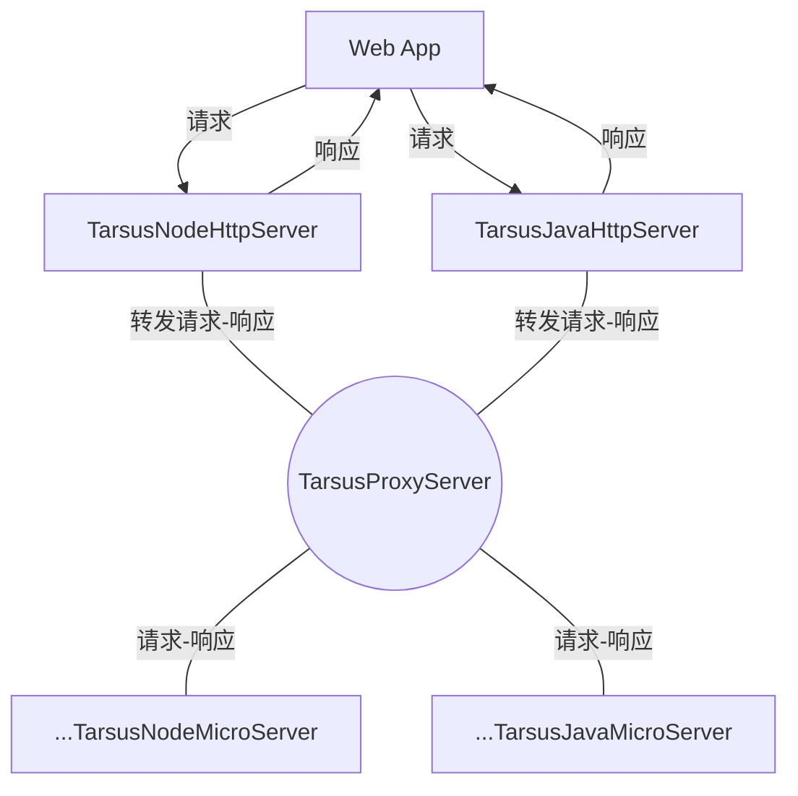

# Tarsus FrameWork

---

Tarsus FrameWork 由 [Ado](https://github.com/chelizichen/ado-node)项目升级改造而来，借助ECMAScript装饰器和Java8注解，可以快速创建并启动HTTP服务或微服务。 ECMAScript中的装饰器特性已经正式进入ES2018版本官方发布，这使得开发者无需担心兼容性问题。装饰器是一种特殊的语法抽象手段，可以装饰类，方法以及对象，使开发者更容易书写和管理程序逻辑，增加了程序的可读性，使其逻辑连贯可懂。此外，使用TypeScript和Java开发，可以提供更生动的语义，帮助Devs更迅速地工作，有效地防止程序错误和 bug 的发生。

---

## 整合的仓库

- [@Tarsus/Node](https://github.com/chelizichen/Tarsus) 包含 Http服务  微服务模块 依赖注入 ORM 等多个开发包的库
- [@Tarsus/Java-Proxy](https://github.com/chelizichen/Tarsus-Java-Proxy) SpringBoot，可以提供Http 服务，也可以调用微服务
- [@Tarsus/Java](https://github.com/chelizichen/Tarsus-Java) Java 微服务模块 示例代码
- [@Tarsus/CLI](https://github.com/chelizichen/Tarsus-cli) 构建Tarsus的命令行工具

### 微服务架构模型

---

Tarsus FrameWork支持事件驱动型微服务，使用nodejs创建微服务网关，可以更好地提高系统的可用性和可伸缩性。 事件驱动微服务网关采用一种非阻塞事件驱动模型，能够高效处理大量的请求，提高网关的性能和可用性。同时，使用nodejs开发的微服务网关，还可以更轻松的实现负载均衡、监控、流量控制、安全策略等功能。

---

### DOC

- [@Tarsus/Node](https://github.com/chelizichen/Tarsus/readme.md)
- [@Tarsus/Java-Proxy](https://github.com/chelizichen/Tarsus-Java-Proxy/readme.md)
- [@Tarsus/Java](https://github.com/chelizichen/Tarsus-Java/readme.md)
- [@Tarsus/CLI](https://github.com/chelizichen/Tarsus-cli/readme.md)

